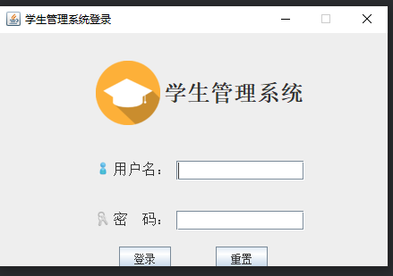

# 学生管理系统

## 设计要求
设计并实现一个应用程序（使用图形用户界面展示），将自己所在宿舍所有学生的学生信息（学号，姓名，性别，年龄）通过界面输入到程序中，并将这些信息保存到txt文件中（保存时可按行保存每个学生信息，学生信息中每个属性可用逗号或分号隔开）；然后实现学生信息的查询、删除和修改等功能，如根据学号查询某位学生。

## 技术选型
- Java
- Swing
- MySQL
- IO

## 目录结构
- studentManager为Swing + MySQL
- studentManager2为Swing + IO

## 运行效果图
</img>

此项目完成于2018年12月31日